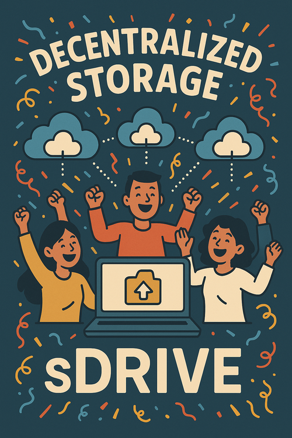

# SDrive NPM Example

<div align="center">
  
  <p>
    <strong>Example project for the SDrive NPM package</strong>
  </p>
  <p>
    <a href="#installation">Installation</a> •
    <a href="#usage">Usage</a> •
    <a href="#examples">Examples</a> •
    <a href="#troubleshooting">Troubleshooting</a>
  </p>
</div>

## About This Project

This is an example project demonstrating how to use the SDrive NPM package to work with decentralized storage. The project contains several examples showing different ways to use SDrive.

### Key Features

- 📤 File upload using buffer
- 📤 File upload using file stream
- 📋 List uploaded files
- 🔧 Environment variable configuration

## Installation

### Prerequisites
- Node.js v18 or newer
- API key from [SDrive](https://sdrive.pro)
- pnpm (recommended) or npm

### Package Installation
```bash
pnpm install
```

### Configuration
1. Copy `.env-example` to `.env`:
```bash
cp .env-example .env
```

2. Update `.env` with your values:
```env
SDRIVE_API_KEY=<your-key>
USER_GUID=<your-guid>
```

## Usage

The project contains three main examples:

1. `1-upload.js` - Demonstrates simple file upload
2. `2-upload-buffer.js` - Shows how to upload files using buffer
3. `3-listObjects.js` - Shows how to retrieve an overview of uploaded files

To run the examples:
```bash
node 1-upload.js
node 2-upload-buffer.js
node 3-listObjects.js
```

## Examples

### 1. Simple File Upload
```javascript
import { SDrive } from "sdrive";
import dotenv from "dotenv";

dotenv.config();

const sdrive = new SDrive(process.env.SDRIVE_API_KEY, process.env.USER_GUID);

try {
  const response = await sdrive.upload("./sdrive.png", "sdrive.png");
  console.log("Upload successful:", response);
} catch (error) {
  console.error("Upload failed:", error);
}
```

### 2. Buffer-based Upload
```javascript
import { SDrive } from "sdrive";
import fs from "fs/promises";
import dotenv from "dotenv";

dotenv.config();

const sdrive = new SDrive(process.env.SDRIVE_API_KEY, process.env.USER_GUID);
const buffer = await fs.readFile("./sdrive.png");

try {
  const response = await sdrive.upload(buffer, "sdrive.png");
  console.log("Upload successful:", response);
} catch (error) {
  console.error("Upload failed:", error);
}
```

### 3. List Files
```javascript
import { SDrive } from "sdrive";
import dotenv from "dotenv";

dotenv.config();

const sdrive = new SDrive(process.env.SDRIVE_API_KEY, process.env.USER_GUID);

try {
  const response = await sdrive.listObjects();
  console.log("File overview:", response);
} catch (error) {
  console.error("Failed to fetch file overview:", error);
}
```

## Troubleshooting

### Common Issues

1. **API Key Not Working**
   - Verify that the API key is correctly copied to the `.env` file
   - Check if the API key is active in the SDrive dashboard

2. **Upload Failing**
   - Check if the file size doesn't exceed the limit
   - Verify that you have sufficient credit on your account

3. **Network Issues**
   - Check your internet connection
   - Verify that the selected network is available

## License

This project is licensed under the ISC License.

## Support

Need help? Visit our [documentation](https://docs.sdrive.pro) or contact us at support@sdrive.pro
